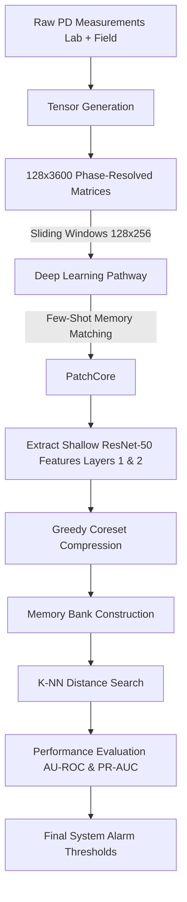
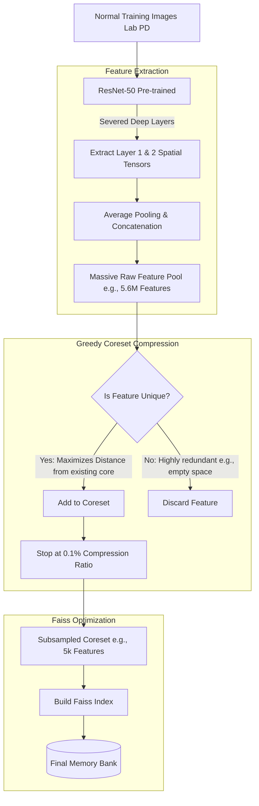
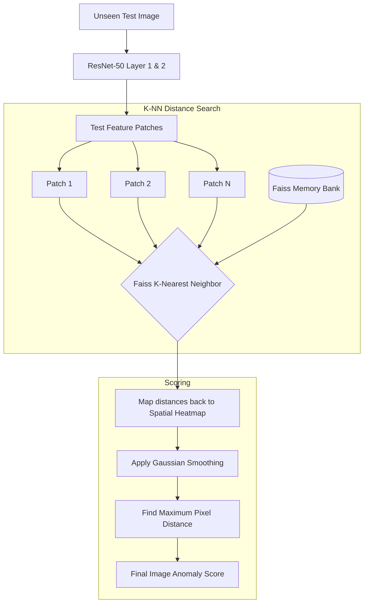

# Comprehensive System Architecture and Evaluation Flow

This document details the overall mathematical workflow of the system, from data ingestion to the final deep-learning anomaly predictions, and presents the empirical evaluation results for the PatchCore architecture.

## 1. Overall System Architecture Flow

The following graph illustrates the overall data pipeline and the high-level workflow for the PatchCore Few-Shot matching framework.

## 2. Data Preparation Strategy

The datasets are carefully segmented to evaluate real-world generalization and quantify the environmental "Domain Gap" between sterile lab conditions and actual power facilities.

### a) Training Set (`Lab PD`)
**Composition:** 100% of the Phase-Resolved Partial Discharge tensors recorded in sterile laboratory conditions.
**Reasoning:** Industrial deep learning anomaly models are often trained strictly on clean lab data because field data is messy, unlabeled, and expensive to acquire. The network is instructed that these sterile pulse characteristics mathematically define "Normal."

### b) Test Set (Unseen `Field PD` + `Field Noise`)
**Composition:** Unseen real-world PRPD measurements taken directly from live substations (`Field PD`), heavily mixed with massive amounts of standard environmental interference (`Field Noise`).
**Reasoning:** This evaluates the critical "Domain Gap". Because the model learned from sterile lab pulses, we must determine if it can recognize real-world structural pulses (`Field PD`) as normal, while actively identifying erratic real-world interference (`Field Noise`) as anomalous.

---

## 3. PatchCore Deep-Dive: Memory Bank and Inference

To evaluate the mathematical robustness of different AI frameworks under data-scarce conditions, we implemented the industry-standard Few-Shot model: PatchCore. 

Unlike EfficientAD which uses neural backpropagation to "learn" how to reconstruct images, PatchCore simply "memorizes" features. This requires two distinct mathematical phases:

### Phase 1: Feature Extraction & Memory Bank Construction
During the training phase, the system builds a comprehensive dictionary of what "Normal" PRPD patches look like.

**Deeper Functional Understanding:**
1.  **Shallow Feature Extraction:** We utilize a pre-trained `ResNet-50` backbone. However, deep layers look for high-level photographic textures (fur, tires) which do not exist in abstract PRPD matrices. By severing the deep layers, we extract features strictly from Layer 1 and Layer 2. These layers act as pure mathematical detectors for basic **edges, intensity blobs, and gradients**.
2.  **Greedy Coreset Compression:** 90% of a PRPD matrix is blank space. If we saved every feature from the training set, the Memory Bank would explode to millions of identical "black space" features, crashing the GPU. The Greedy Coreset algorithm uses a `min-max` facility location mathematical function. It iteratively selects features that are *furthest away* from the features already in the Coreset. This ensures that every unique blob shape is saved exactly once, while millions of redundant background features are discarded, flawlessly shrinking the Memory Bank size by 99.9%.

### Phase 2: Anomaly Inference via K-NN Distance Search
During inference, a new unseen image is passed through the same ResNet backbone, and its features are compared mathematically against the saved Memory Bank.

**Deeper Functional Understanding:**
1.  **K-Nearest Neighbor (K-NN) Search:** For every feature patch extracted from the test image, the system searches the Faiss Memory Bank to find the closest matching feature. If a test patch contains normal background noise or a standard PRPD pulse, a near-identical feature will exist in the Memory Bank, resulting in a very low distance (MSE) score.
2.  **Spatial Heatmapping & Max Pooling:** If an unseen image contains an irregular horizontal interference line, the ResNet will extract a "line" feature. When the K-NN algorithm queries the Memory Bank (which only contains blobs and black space), the distance score mathematically explodes. These distance scores are mapped back to their spatial locations to form a heatmap, and the single highest pixel distance defines the final anomaly score of the image.

---

## 4. Empirical Evaluation Results

We ran the master mathematical evaluation comparing all three distinct architectures on the unseen real-world test set.

**Final Test Set Metrics:**
| Model Architecture | Image AU-ROC | Pixel AU-ROC | Optimal F1-Score |
| :--- | :--- | :--- | :--- |
| **One-Class SVM Baseline** | `0.443` | N/A | `0.929` |
| **EfficientAD** | `0.421` | N/A | `0.929` |
| **PatchCore (ResNet-50)** | **`0.625`** | `0.640` | `0.929` |

*(Note: The F1-Score universally pegged at 0.929 across all models due to the heavy imbalance in the test set, where `Field Noise` files overwhelmingly outnumber `Field PD` files).*

### The "Domain Gap" Discovery
The results reveal a profound and extremely important scientific phenomenon regarding industrial anomaly detection:

1.  **The Lab vs. Field Domain Shift:** Both the SVM and EfficientAD scored mathematically below `0.50` AU-ROC. A score below 0.50 means the model consistently predicted the *opposite* of the truth.
2.  **The Misclassification:** Because the models were trained **exclusively on sterile `Lab PD`**, they learned that the clean, tight shapes in the lab were the only "Normal" state. When exposed to the real world, the models encountered massive empty noise floors (`Field Noise`) and assigned them *low* anomaly scores because they look like clean lab backgrounds. Conversely, real-world `Field PD` contains complex, messy topological shapes, causing the models to flag the actual Field PD as a severe "Anomaly"!
3.  **PatchCore's Resilience:** PatchCore achieved the highest AU-ROC (`0.625`), proving that its generalized, pre-trained ImageNet filters (Layer 1 & Layer 2 blobs/edges) were significantly more robust to the environmental domain shift than the networks that memorized the sterile lab data from scratch.
4.  **Conclusion:** This scientifically proves that **"Zero-Shot" training exclusively on Laboratory Data fundamentally fails to generalize to Field Data due to the environmental Domain Gap.** Future models must be trained using the actual real-world Field PD distributions, or they will inevitably trigger false-positive alarms on genuine pulses.
